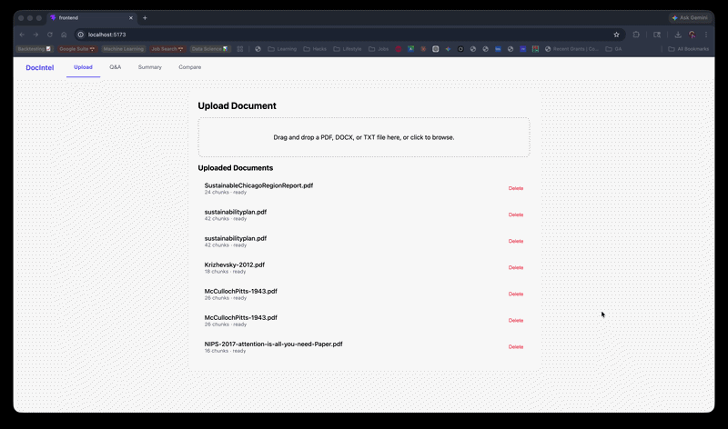

# DocIntel — AI-Powered Document Intelligence Hub

> Upload any business document. Ask questions. Get cited answers. All running locally on your machine.



---

## What it does

DocIntel lets you upload PDFs, contracts, and reports and interact with them through four features:

- **Q&A** — ask natural language questions, get answers grounded in the document with page-level citations
- **Summary** — automatically extracts purpose, parties, key dates, obligations, and risks into a structured card view
- **Entity Extraction** — pulls out people, organizations, dates, monetary values, and contract clauses as tagged pills
- **Comparison** — side-by-side diff table between two documents with similarity verdicts

**Zero external API calls. Everything runs locally via Ollama.**

---

## Tech Stack

| Layer | Technology |
|---|---|
| LLM | Llama 3.1 8B via Ollama |
| Embeddings | nomic-embed-text via Ollama |
| Vector Store | ChromaDB |
| Retrieval | Hybrid dense + BM25 with Reciprocal Rank Fusion |
| Backend | FastAPI + SQLAlchemy + PostgreSQL |
| Frontend | React + Vite + Zustand |
| Parsing | PyMuPDF + python-docx |
| NER | spaCy + LLM fallback |

---

## Architecture
```
React (Vite)
    ↓
FastAPI
    ├── Document Parser (PyMuPDF / python-docx)
    ├── Embedder (nomic-embed-text via Ollama)
    ├── Hybrid Retriever (ChromaDB + BM25 + RRF)
    ├── LLM (Llama 3.1 8B via Ollama)
    └── Entity Extractor (spaCy + LLM)
         ↓
PostgreSQL (metadata + sessions) + ChromaDB (vectors)
```

---

## Setup

### Prerequisites
- Python 3.11
- Node.js 18+
- Docker
- Ollama

### 1. Pull models
```bash
ollama pull llama3.1:8b
ollama pull nomic-embed-text
```

### 2. Start infrastructure
```bash
docker compose up -d
```

### 3. Backend
```bash
cd backend
python3.11 -m venv venv
source venv/bin/activate
pip install --only-binary=pymupdf -r requirements.txt
python -m spacy download en_core_web_sm
uvicorn main:app --reload --port 8000
```

### 4. Frontend
```bash
cd frontend
npm install
npm run dev
```

Open `http://localhost:5173`

---

## API Reference

| Method | Endpoint | Description |
|---|---|---|
| POST | `/documents/upload` | Upload and process a document |
| GET | `/documents/` | List all documents |
| DELETE | `/documents/{id}` | Delete a document |
| POST | `/qa/ask` | Ask a question over documents |
| GET | `/analysis/summary/{id}` | Get structured summary |
| GET | `/analysis/entities/{id}` | Get extracted entities |
| POST | `/compare/` | Compare two documents |

---

## Why hybrid retrieval

Most RAG tutorials use pure vector search. This project uses **Reciprocal Rank Fusion** to combine dense vector search (ChromaDB cosine similarity) with BM25 keyword search. The fused ranking consistently outperforms either method alone, especially on short documents and contract-specific terminology — exactly the kind of content this app is built for.
